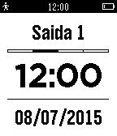

Meu Ponto Pebble
================

Meu Ponto Pebble allows you to add entries to [Meu Ponto] using your Pebble.
All data is synchronized in real time with your [Meu Ponto] account.
You can then edit and tweak everything on Meu Ponto using your browser (both on mobile and desktop).

Note that Meu Ponto Pebble is currently only available in Portuguese.

Screenshot
----------

Requirements
------------

Before using Meu Ponto Pebble, you need to:
- Register to Meu Ponto at: http://meu-ponto.appspot.com/
- Go to settings (Configurações) on the website
- Select integration (Integração) and save
- Copy the given information (User and Token)
- Open Meu Ponto Settings under the Pebble App on your phone
- Input copied information (User and Token) and save

Development
-----------
If you want to build and run Meu Ponto Pebble yourself, you'll need to use the [Pebble SDK] or [CloudPebble].

Follow the instructions on their specific web pages:

* Pebble SDK: http://developer.getpebble.com/sdk/install/
* CloudPebble: https://cloudpebble.net

Controls
--------

- UP button
 - _single click:_ change the entry type
 - _long click:_ add an entry to Meu Ponto using current info

- SELECT button
 - _single click:_ go back 1 minute
 - _long click:_ set the actual time

- DOWN button
 - _single click:_ go back 1 day
 - _long click:_ set the actual date

[Meu Ponto]: https://github.com/rafaelwmartins/meu-ponto
[Pebble SDK]: http://developer.getpebble.com/sdk/
[CloudPebble]: https://cloudpebble.net/
